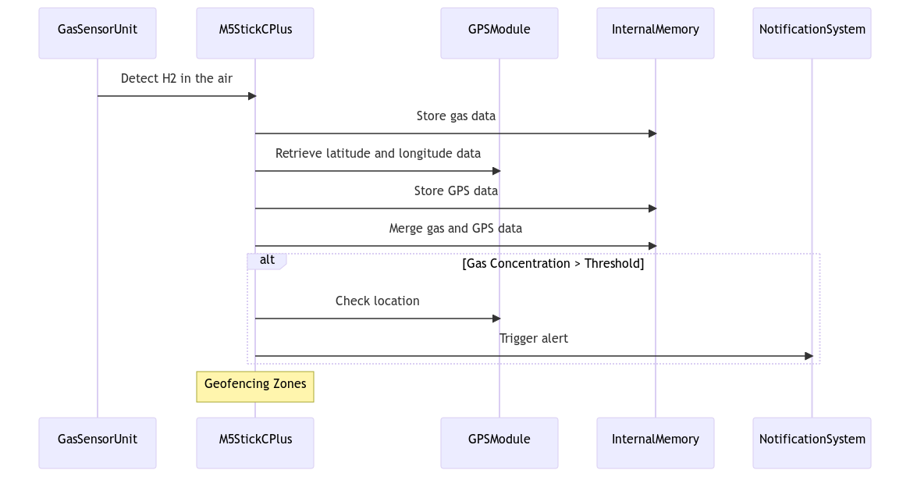
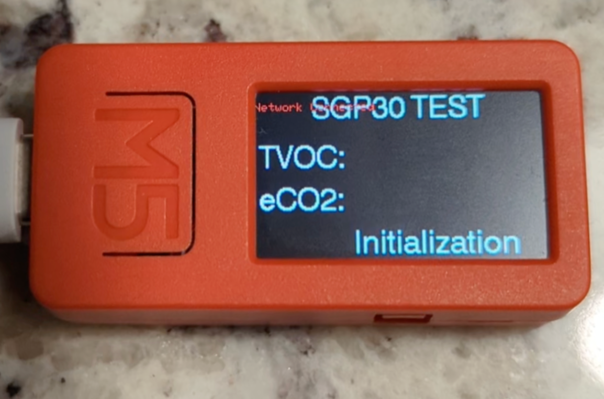
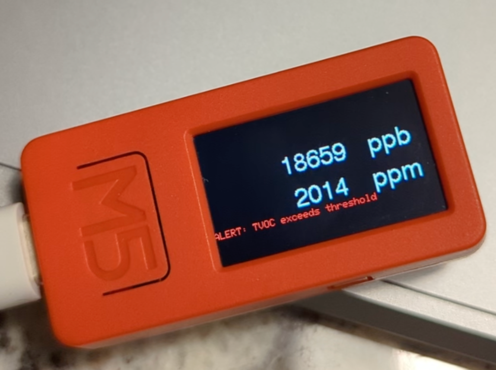
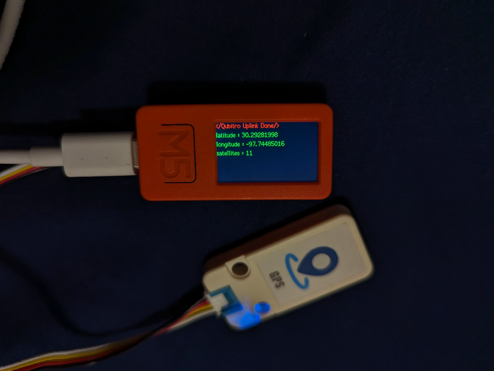

# Smart Air Quality Alert System
Air Quality Alert System built on M5StickC Plus integrated with AT6558 and SGP30 sensors

### Technological Components
- M5StickC PLUS ESP32-PICO Mini IoT Development Kit
- Mini GPS/BDS Unit (AT6558)
- TVOC/eCO2 Gas Sensor Unit (SGP30)
- Qubitro Data Platform

### Existing Solutions (As of January 2023)
Current air quality monitoring solutions often consist of standalone
sensors or mobile applications.

Examples: Devices like the PurpleAir sensor network and mobile apps like
AirVisual provides real-time air quality data. However, limited integration
with GPS for mobile users is observed.

### Technological Gaps in Existing Solutions
**Identified Gaps:** Existing solutions may face challenges in
seamless integration of diverse sensor data, real-time user
guidance based on location, and comprehensive data
visualization.

**Opportunities for Improvement:** There is room for improvement in
addressing the limitations of current solutions, particularly in enhancing
user interaction, data accuracy, and the integration of diverse
environmental parameters.

### Room for Innovation
**Integration and Interoperability:** Opportunities exist to create a more integrated solution
where GPS and air quality data are seamlessly combined and communicated to a
centralized platform.

**User Interaction:** Innovations in user interfaces can improve the accessibility and usability
of the system for a broader audience.

**Scalability:** There is room for innovation in creating a scalable system capable of handling a
large number of connected devices and processing data efficiently.

### Innovative Features

Provides real-time alerts when reads a high concentration of harmful
gases in the surroundings

- GPS tracking for spatial context.
- Real-time monitoring of TVOC and eCO2 levels.
- Data integration and visualization via the Qubitro platform.

**Unique Value Proposition:** Our project introduces a unique value proposition by
combining GPS and air quality data to provide real-time guidance to users.

**Potential Enhancements:** Future enhancements may include integrating additional
environmental sensors, creating personalized user profiles, and expanding the
system's capabilities for broader environmental monitoring.

### System Architecture

- Two M5StickC Plus devices serving distinct
functions.

- Device 1 is equipped with a GPS sensor for
precise location tracking.

- Device 2 is equipped with an SGP30 sensor for
real-time air quality monitoring.

#### INTEGRATION HUB
- Qubitro platform acts as the central hub for data
integration and analysis.

- Facilitates seamless communication between
devices and data storage.

### Data Flow
*Step 1* -
M5StickC devices
collect real-time data.

*Step 2* -
Data is transmitted to
the Qubitro platform for
storage and processing.

*Step 3* -
Users can access
integrated data for
visualization and
analysis.

### Benefits
- Accurate tracking of user movement.
- Early detection of air quality issues.
- Seamless integration for a user-friendly experience.
